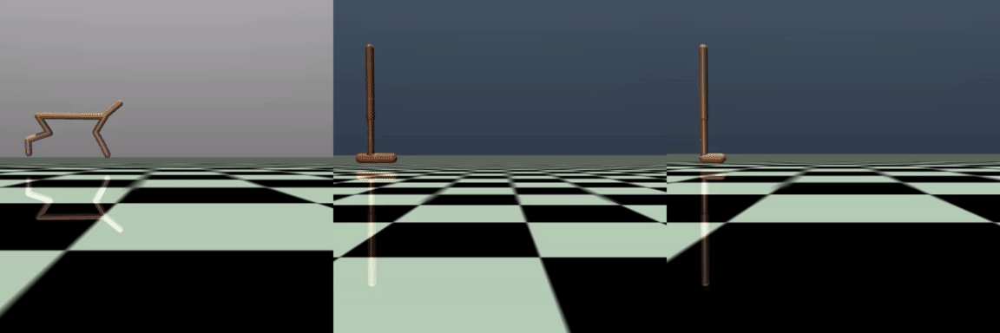

# Official Repo for DeFog

[](https://www.python.org/downloads/release/python-3109/)
[](https://arxiv.org/abs/2303.03391)
[](https://github.com/hukz18/DeFog/blob/master/LICENSE)

- [Overview](#overview)
- [Setup](#setup)
- [Datasets](#datasets)
- [Acknowledgments](#acknowledgments)


## Overview

Code release for the ICLR 2023 conference paper:

<table><tr><td>
    <strong>
        <a href="https://arxiv.org/abs/2303.03391">
            DeFog: Decision Transformer under Random Frame Dropping
        </a><br/>
    </strong>
    Kaizhe Hu*<sup>1,3</sup>,  Ray Chen Zheng*<sup>1,3</sup>, Yang Gao<sup>1,2,3</sup>, Huazhe Xu<sup>1,2,3</sup><br/>
    Conference on Learning Representations (ICLR) 2023
</td></tr></table>

<sup>1</sup><em>Tsinghua Universtiy,</em>
<sup>2</sup><em>Shanghai AI Lab,</em>
<sup>3</sup><em>Shanghai Qi Zhi Institute</em>

---

DeFog is an offline RL algorithm
that enables agents to act robustly in frame dropping scenarios (where observations are not arrived at each timestep, but have a possibility to be dropped). DeFog is able to remain much of the performance when the dropping rate is as high as 90% (as shown in the figure below), while the naive approach to repeat the last action has near zero perfermance once the dropping rate is above 50%.


<p align="center">
  
</p>

DeFog first randomly masks out data in the offline datasets and explicitly adds the time span of frame dropping as inputs. After that, a finetuning stage on  the same offline dataset with a higher mask rate would further boost the performance. Please refer to the conference paper for further information.

## Setup
To create the environment of defog, firstly run the following command:
```
conda env create -f environment.yml
```
This will create a conda environment named "defog". 

The repo uses [Hydra](https://hydra.cc) to manage the configuration of the experiments. It enables users to overwrite hypermeters in the command line and store the training outputs in separate folders automatically. Please refer to the [documentation](https://hydra.cc/docs/intro/) for more details.

### MuJoCo Experiments

For experiments in the MuJoCo environment, first cd to the `mujoco` folder, then run `pip install requirements.txt` to install the additional dependencies for mujoco.

You will need to download the dataset manually by running the `download_d4rl_dataset.py` first, this will download the [D4RL](https://github.com/Farama-Foundation/D4RL) datasets of mujoco to the `$HOME/.d4rl/datasets` folder. 

After downloading the datasets, run 
```python main.py```
for training DeFog on the hopper medium dataset. The result curves can be find under a autogenerated folder named after the current timestamp under the path `mujoco/runs`.

For other environments and datasets, overwrite the settings in default config file (`cfgs/config.yaml`) in the command line. For example, use  ```python main.py env=walker2d buffer.dataset=expert``` to run DeFog on the walker2d expert dataset. You can directly modify the config file as well.

You can also use the multiprocessing version to train multiple seeds in parallel:
```python main_mp.py```

### Atari Experiments

For experiments in the Atari environment, first cd to the `atari` folder, then run `pip install requirements.txt` to install the additional dependencies.

After installing the dependencies, you can use ```python main.py``` for training DeFog on the breakout expert dataset. You can override the environment and dataset like ```python main.py env=qbert buffer.dataset_type=medium```. Please refer to the [documentation](https://github.com/takuseno/d4rl-atari) of d4rl-atari for a description of the datasets.

You may want to contrain the cpu usage in a multi-core platform by setting the environment variable `export OMP_NUM_THREADS=8`.

You can also use the multiprocessing version to train multiple seeds in parallel:
```python main_mp.py```

## Acknowledgements

The repo is a re-implementation of the code used in the paper, as we clean up and refactor the code a lot. The repo now utilizes a unified training pipeline, data buffer, and model architecture among the MuJoCo and Atari environment, which is not the case in the original Decision Transformer repo, we also optimized the data buffer for better performance. The code is based on the implementation of [min-decision-transformer](https://github.com/nikhilbarhate99/min-decision-transformer/tree/master). This repo is not necessarily an exact reproduction of the original paper (however the performance is basically the same), but a version that is easy to use, more understandable, and aims to better deliver the idea of DeFog.

## Citation

If you find this code useful, consider citing our work:

```bibtex
@article{Hu2023DecisionTU,
  title={Decision Transformer under Random Frame Dropping},
  author={Kaizhe Hu and Ray Chen Zheng and Yang Gao and Huazhe Xu},
  journal={ArXiv},
  year={2023},
  volume={abs/2303.03391}
}
```
